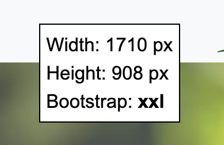

# pagesize-widget
This Javascript file create a widget on the top left of the screen displaying the page size and bootstrap breakpoints. I noticed that this helps a lot when you are not familiar with bootstrap screen sizes.

Feel free to use it, copy it, fork it, or whatever.



## How to use it
Just copy-paste this line at the very end of your HTML:
```
<script src="https://share.alkanife.dev/dist/pagesize-widget.js"></script>
```

Or direcly download the Javascript file.
